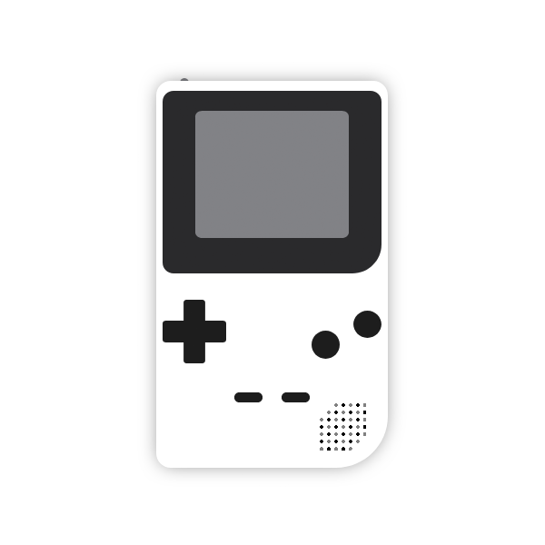

<p align="center">
  
</p>

# Gameboy

Mock page for Gameboy Pocket, Color and Light.

Design by Agnes Pinhanelli.

Just for fun 🎉

## Built with

- Webpack 4
- Babel 7.5
- Pug
- Sass

## How to run

Make sure you have [`yarn`](https://yarnpkg.com) already installed in your computer.

Install the project then run it with the following commands.

```
yarn
yarn start
```

Project will run on port [`8080`](http://localhost:8080/).
